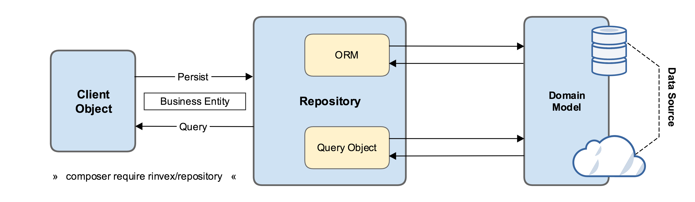

<p align="center"><a href="https://laravel.com" target="_blank"></a></p>

<p align="center">
<a href="https://github.com/laravel/framework/actions"></a>
<a href="https://packagist.org/packages/laravel/framework"></a>
<a href="https://packagist.org/packages/laravel/framework"></a>
<a href="https://packagist.org/packages/laravel/framework"></a>
</p>

# ALUMNI - BE

### Source: https://github.com/winsnyder/laravel-source-base

### Environment:

- PHP version 8.2
- Composer version 2.5.8
- Laravel version 10.14.1

### Pattern: Repository Patterns



### Create API

1. Khởi tạo một interface khai báo các phương thức sử dụng trong repository

Name convention: I<ObjectName>Repository.php

```php
<?php

namespace App\Interfaces;

use App\Http\Requests\StorePostRequest;
use App\Http\Requests\UpdatePostRequest;

interface IPostRepository
{
    public function getAllPost();
    public function getPostById($postId);
    public function getPublishedPosts();
    public function createPost(StorePostRequest $storePostRequest);
    public function updatePost($postId, UpdatePostRequest $updatePostRequest);
    public function deletePost($postId);
}
```

1. Tạo class Repository để implement các phương thức được khai báo

```php
<?php

namespace App\Repositories;

use App\Http\Requests\StorePostRequest;
use App\Http\Requests\UpdatePostRequest;
use App\Interfaces\IPostRepository;
use App\Models\Post;

class PostRepository implements IPostRepository
{
    private Post $post;
    public function __construct(Post $post)
    {
        $this->post = $post;
    }

    public function getAllPost()
    {
        return $this->post->all();
    }

    public function getPostById($postId)
    {
        return $this->post->findOrFail($postId);
    }

    public function getPublishedPosts()
    {
        return $this->post->where('is_published', true)->get();
    }

    public function createPost(StorePostRequest $storePostRequest)
    {
        return $this->post->create($storePostRequest->toArray());
    }

    public function updatePost($postId, UpdatePostRequest $updatePostRequest)
    {
        $post = $this->post->find($postId);
        if ($post) {
            $post->update($updatePostRequest->toArray());
        }
    }

    public function deletePost($postId)
    {
        $this->post->destroy($postId);
    }
}
```

1. Thực hiện binding  servcie provider dể inject repository vào trong controller

App\Providers\RepositoryServiceProvider.php

```php
<?php

namespace App\Providers;

use Illuminate\Support\ServiceProvider;
use App\Interfaces\IPostRepository;
use App\Repositories\PostRepository;

class RepositoryServiceProvider extends ServiceProvider
{
    /**
     * Register services.
     */
    public function register(): void
    {
        $this->app->bind(IPostRepository::class, PostRepository::class);
    }

    /**
     * Bootstrap services.
     */
    public function boot(): void
    {
        //
    }
}
```

1. Tạo controller

```php
<?php

namespace App\Http\Controllers;

use App\Http\Requests\StorePostRequest;
use App\Http\Requests\UpdatePostRequest;
use App\Interfaces\IPostRepository;
use Illuminate\Http\Request;

class PostController extends Controller
{
    private IPostRepository $postRepository;

    public function __construct(IPostRepository $postRepository)
    {
        $this->postRepository = $postRepository;
    }

    /**
     * Display a listing of the resource.
     *
     * @param  \Illuminate\Http\Request  $request
     * @return \Illuminate\Http\Response
     */
    public function index(Request $request)
    {

        $data = $request->is_published === "true" ?
            $this->postRepository->getPublishedPosts() :
            $this->postRepository->getAllPost();

        return response()->json([
            "message" => 'success',
            'data' => $data
        ]);
    }

    /**
     * Store a newly created resource in storage.
     *
     * @param  \App\Http\Requests\StorePostRequest  $request
     * @return \Illuminate\Http\Response
     */
    public function store(StorePostRequest $request)
    {
        return response()->json(
            [
                "message" => 'success',
                'data' => $this->postRepository->createPost($request)
            ],
        );
    }

    /**
     * Display the specified resource.
     *
     * @param  \Illuminate\Http\Request  $request
     * @return \Illuminate\Http\Response
     */
    public function show(Request $request)
    {
        return response()->json([
            "message" => 'success',
            'data' => $this->postRepository->getPostById($request->route('id'))
        ]);
    }

    /**
     * Update the specified resource in storage.
     *
     * @param  \App\Http\Requests\UpdatePostRequest  $request
     * @return \Illuminate\Http\Response
     */
    public function update(UpdatePostRequest $request)
    {
        return response()->json([
            "message" => 'success',
            'data' => $this->postRepository->updatePost($request->route('id'), $request)
        ]);
    }

    /**
     * Remove the specified resource from storage.
     *
     * @param  \Illuminate\Http\Request  $request
     * @return \Illuminate\Http\Response
     */
    public function destroy(Request $request)
    {
        $this->postRepository->deletePost($request->route('id'));

        return response()->json([
            "message" => 'success',
        ]);
    }
}
```

1. Khởi tạo router

```php
Route::controller(PostController::class)->prefix('posts')->group(function () {
    Route::get('/', 'index');
    Route::get('/{id}','show');
    Route::post('/create', 'store');
    Route::post('/update/{id}', 'update');
    Route::delete('/{id}', 'destroy');
});
```

1. Api Response

```json
{
    "message": "success",
    "data": [
        {
            "id": 1,
            "title": "Vel architecto.",
            "content": "Ducimus nam minus et modi eveniet. Sit laborum temporibus aperiam. Temporibus ipsam eos doloremque qui. Ullam ut ipsa sequi soluta sunt ea eos.",
            "is_published": 1,
            "created_at": "2023-07-05T02:59:17.000000Z",
            "updated_at": "2023-07-05T02:59:17.000000Z"
        },
        {
            "id": 2,
            "title": "Aliquam et.",
            "content": "Corporis voluptas nobis sunt dolores repellat aut. Reprehenderit corporis alias nobis velit. Corporis expedita quae voluptatem magnam quo.",
            "is_published": 1,
            "created_at": "2023-07-05T02:59:17.000000Z",
            "updated_at": "2023-07-05T02:59:17.000000Z"
        }
    ]
}
```

### Build project by Docker and Nginx

Resource:

Image - Dockerfile

Container  - docker-compose.yml

Build Image

```bash
./build_image.sh
```

Build Container

```bash
docker-compose up -d
```